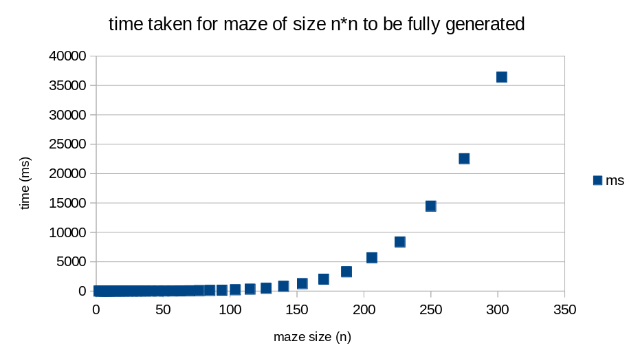
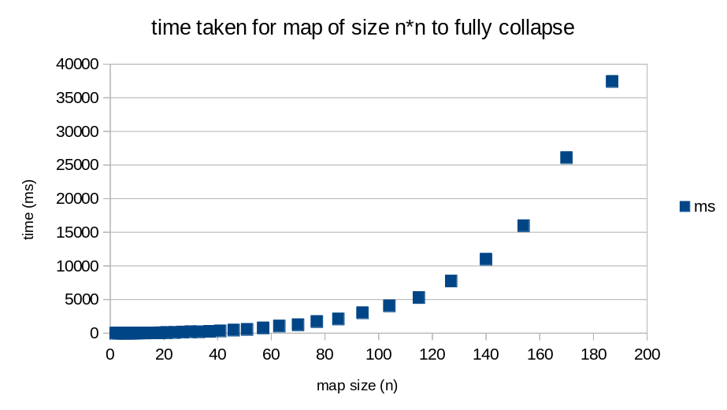

# Implementation document

## Project structure

The project works by index.ts working as a middleman between the algorithm, controls and visualization. index.ts handles the state of the application andlistens for events from the controls. Also algorithm processing callbacks are handled in index.ts and then translated to visualization updates.

The idea for this structure is that the algorithm and visualization are independent of each other so testing the algorithm is way easier as the test runner doesn't need to so web browser stuff.

-   `src/` Code for the project
    -   `collapse.ts` Contains the algorithm for wave function collapse
    -   `maze.ts` Contains the code for generating mazes
    -   `utils.ts` Contains utility functions that either combine the use of maze and collapse or are in general utility functions
    -   `filename.test.ts` Contains tests for the above files
    -   `index.ts` Main file that runs correct algorithm code based on what the user has selected and handles the communication between the visualization and the algorithm code
    -   `appCanvas.ts` Contains the code for the visualization
    -   `controls.ts` Contains the code for the control panel
-   `performanceTests/` Contains performance tests for the algorithm
    -   `performance.ts` Contains a basic performance test for the maze generation and wave function collapse
-   `public/` Static files eg. html, css and images
-   `documentation/` Contains documentation files for the project
    -   `images/` Contains images used in documentation

## Performance

The goal of this project was more of a visualizer so absolute performance wasn't a goal. A lot of performance is lost in the required visualization handlers even when they aren't used as the code still runs through eg. the sleeping function with a 0ms sleep time. From a quick test about 50% of the time spent in checking possible tiles for a cell is spent in trying to sleep for 0ms.

One problematic part for performance with larger maps is that sometimes the algorithm get's stuck and has to backtrack but it doesn't know what would be more optimal cells to uncollapse. This causes that sometimes the algorithm has to backtrack a lot and almost has to start from the beginning again.

The O notation of both of the algorithms isn't that clear as the speed depends on what a random number generator returns. The collapsing algorithm is probably O(n\*m\*t) where n and m is the width and height of the map and t is the amount of tiles used.

For the maze generation algorithm the O notation is probably O(n\*m) where n and m is the width and height of the map.

#### Maze generation performance

#### wfc performance

## Improvement ideas

-   Improve performance ecpecially in the backtracking algorithm
-   Add a way to save the generated map as an image
-   Use a better rendering method (like WebGL) to improve performance when rendering large maps
-   Use web workers for generation so UI doesn't freeze when generating large maps
-   Add ability to manually collapse tiles and generate maze paths from the UI
-   Improve visualization of the backtracking algorithm

## Links to resources used for the algorithms in the project

-   https://robertheaton.com/2018/12/17/wavefunction-collapse-algorithm/
-   https://bolddunkley.itch.io/wfc-mixed
-   https://weblog.jamisbuck.org/2011/1/20/maze-generation-wilson-s-algorithm

## Carcassonne tile image credits

[https://en.wikipedia.org/wiki/Carcassonne\_(board_game)](<https://en.wikipedia.org/wiki/Carcassonne_(board_game)>)

Default tile images taken from wikipedia ([CC BY-SA 4.0](https://creativecommons.org/licenses/by-sa/4.0/))
Images made by [Mliu92](https://commons.wikimedia.org/wiki/User:Mliu92)
