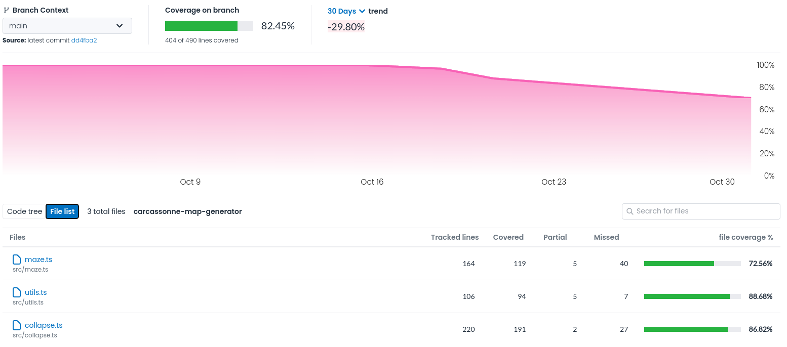

# Testing document

Coverage report is available at [app.codecov.io/gh/motsgar/carcassonne-map-generator](https://app.codecov.io/gh/motsgar/carcassonne-map-generator)

## What is tested and how

All algorithm code is tested with unit tests. The tests are written with the [Jest](https://jestjs.io/) testing framework. Code coverage is measured with [Codecov](https://about.codecov.io/).

The reason that coverage isn't higher is that some parts of the algorithm code contains visualization specific code so those parts are not tested. The visualization is tested by seeing that it works in the browser. The tested files are `collapse.ts`, `maze.ts` and `utils.ts`.

## How to run tests

To run tests, run `npm test` in the root directory of the project. This will run all tests.
